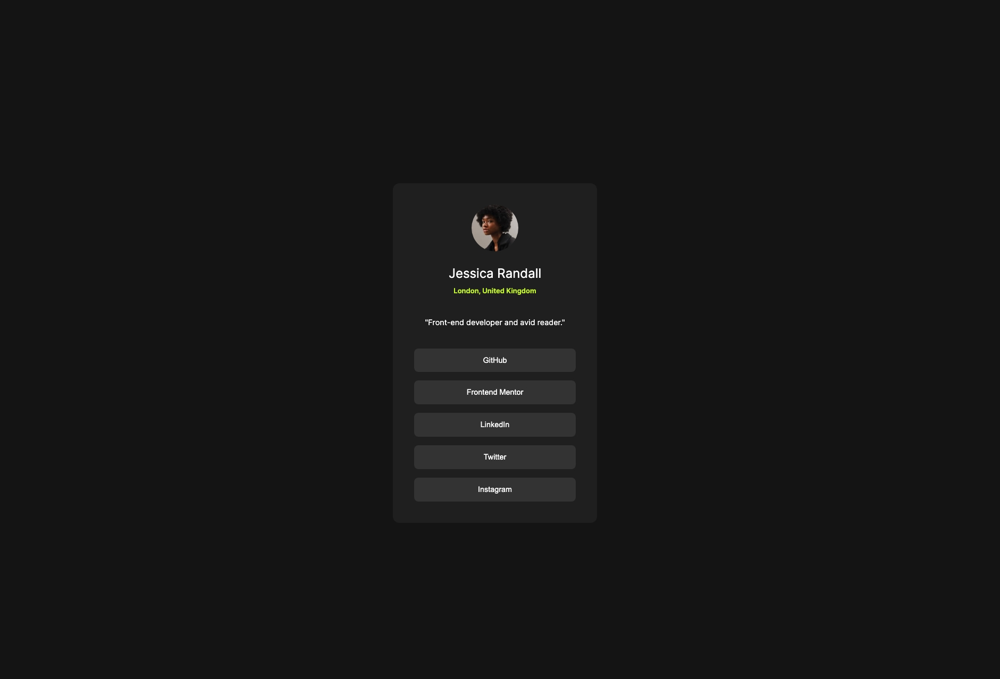
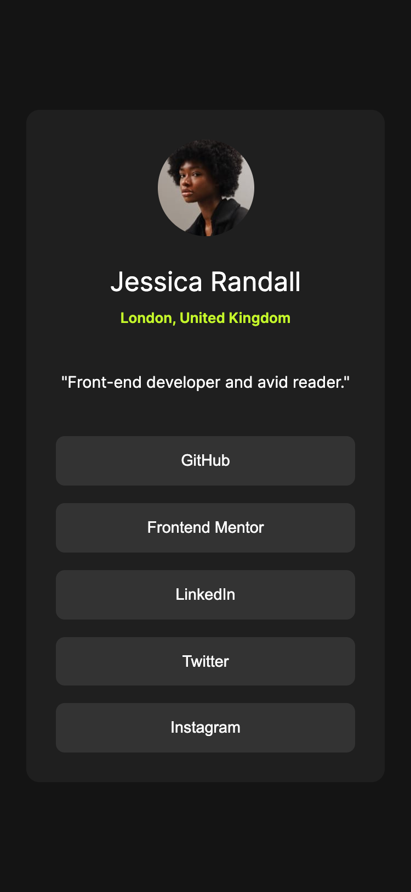

# Frontend Mentor - Social links profile solution

This is a solution to the [Social links profile challenge on Frontend Mentor](https://www.frontendmentor.io/challenges/social-links-profile-UG32l9m6dQ). Frontend Mentor challenges help you improve your coding skills by building realistic projects. 

## Table of contents

- [Overview](#overview)
  - [The challenge](#the-challenge)
  - [Screenshot](#screenshot)
  - [Links](#links)
- [My process](#my-process)
  - [Built with](#built-with)
  - [What I learned](#what-i-learned)
  - [Continued development](#continued-development)
  - [Useful resources](#useful-resources)
- [Author](#author)

## Overview

### The challenge

Users should be able to:

- See hover and focus states for all interactive elements on the page

### Screenshots





### Links

- Solution URL: [GitHub Repo](https://github.com/tmelnychenko/social-links-profile)
- Live Site URL: [GitHub Pages](https://tmelnychenko.github.io/social-links-profile)

## My process

### Built with

- Semantic HTML5 markup
- CSS custom properties
- CSS functions
- Custom Font - Inter
- Flexbox
- Mobile-first workflow

### What I learned

I learned how to use Clamp and Calc CSS Functions to make padding responsive

```css
.container {
    border-radius: 0.75rem;
    padding: clamp(1.5rem, calc(0.5rem + 5vw) ,2.5rem);
    ...
}
```

### Continued development

I would like to learn more about CSS Functions and their usage instead of media queries

### Useful resources

- [HTML Semantics](https://www.w3schools.com/html/html5_semantic_elements.asp) - This helped me to refresh knowledge about semantic tags and how to use them in the project.
- [CSS Function Clamp](https://developer.mozilla.org/en-US/docs/Web/CSS/Reference/Values/clamp) - This helped me to make responsive padding according to the design

## Author

- Frontend Mentor - [@tmelnychenko](https://www.frontendmentor.io/profile/tmelnychenko)